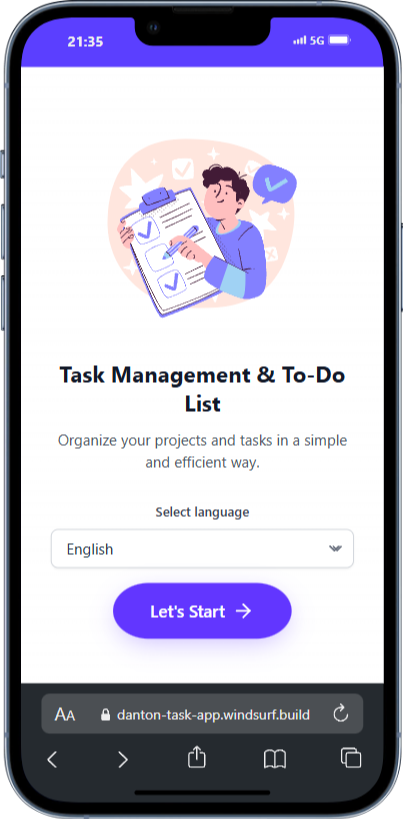
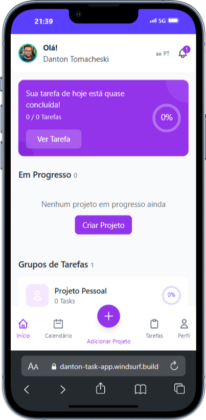
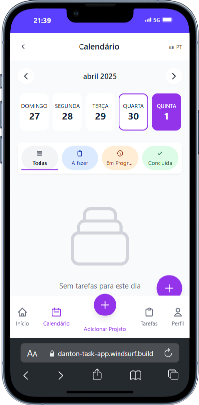
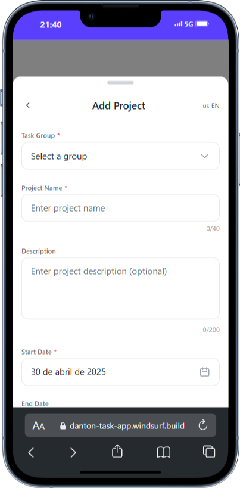

# Task Management & To-Do App 📆

[🔗 **Acesse o projeto em produção**](https://to-do-list-danton.windsurf.build/)

A slick, mobile-first task manager built with Vite, React 18, TypeScript & Tailwind CSS.

[](LICENSE)
[](https://vitejs.dev)
[](https://tailwindcss.com)
[](https://react.dev)

## ✨ Features

- **Beautiful gradient UI** inspired by modern mobile design
- **Vite + React 18** with lightning-fast HMR
- **Zustand Persist** for local state management
- Utility-first **Tailwind CSS**
- **Atomic Design** structure for maintainability
- **React Router 6** for declarative routing
- Multi-language ready via **i18n**
- Strict **TypeScript** everywhere
- Automatic image compression for uploads (`browser-image-compression`)
- Offline-first **PWA** capabilities (installable, works offline)
- Custom CSS **animations** (`fade-in`, `slide-up`, `bounce`, `spin`)
- Unit & integration tests with **Jest + RTL**
- Dark-mode-ready tokens
- Zero-config SVG asset support

## 🚀 Quick Start

```bash
# 1. Install deps
pnpm i  # or npm i / yarn

# 2. Run dev server  📲
pnpm dev

# 3. Build for prod
pnpm build && pnpm preview

# 4. Run Unit/Integration Tests
pnpm test

# 5. Install Playwright browsers (needed for E2E tests)
npx playwright install --with-deps

# 6. Run E2E Tests
npx playwright test

# 7. View E2E Test Report
npx playwright show-report
```

> **Environment** – all `.env.*` variables are auto-imported via Vite (see `import.meta.env`).

## 🗂️ Project Structure

```
task-app/
├─ public/
├─ src/
│ ├─ assets/ # svg, etc.
│ ├─ atoms/ # atomic UI primitives
│ ├─ molecules/ # small composed components
│ ├─ organisms/ # large feature blocks
│ ├─ templates/ # page layouts
│ ├─ pages/ # route entry points (rendered by routes)
│ ├─ routes/ # React Router 6 route components
│ ├─ store/ # zustand stores
│ ├─ services/ # Utilities (image compression, etc.)
│ ├─ i18n/ # translations
│ ├─ App.tsx # root component
│ ├─ main.tsx # vite entry
│ └─ index.css # Tailwind base + custom keyframes
├─ tailwind.config.ts
├─ jest.config.ts # Jest setup
└─ README.md
```

## 📚 Documentation

A full set of living docs lives in the **`/documentation`** folder at project root:

| File                                                                                 | What it answers                            |
| ------------------------------------------------------------------------------------ | ------------------------------------------ |
| [`project_requirements_document.md`](documentation/project_requirements_document.md) | "What exactly are we building and why?"    |
| [`app_flow_document.md`](documentation/app_flow_document.md)                         | Step-by-step UX journey with edge-cases    |
| [`app_flowchart.md`](documentation/app_flowchart.md)                                 | Mermaid diagram of screen & data flow      |
| [`frontend_guidelines_document.md`](documentation/frontend_guidelines_document.md)   | Coding conventions, atomic rules, a11y     |
| [`tech_stack_document.md`](documentation/tech_stack_document.md)                     | Plain-language explanation of every tech   |
| [`implementation_plan.md`](documentation/implementation_plan.md)                     | Phase-by-phase checklist (setup → CI/CD)   |
| [`security_guideline_document.md`](documentation/security_guideline_document.md)     | Input sanitising, quota handling, SW notes |

## 🖌️ Styling & Animations

Tailwind core layers are injected via **`@tailwind base; components; utilities;`** in `index.css`.

### Custom Keyframes

| Class                  | Keyframe    | Purpose                  |
| ---------------------- | ----------- | ------------------------ |
| `.animate-fade-in`     | `fadeIn`    | Smooth page / card entry |
| `.animate-slide-up`    | `slideUp`   | Modal & sheet entrance   |
| `.animate-slide-down`  | `slideDown` | Dropdown / toast         |
| `.animate-bounce-once` | `bounce`    | FAB tap feedback         |
| `.animate-spin`        | `spin`      | Loaders / spinners       |

### Scrollbars

```css
.scrollbar-hide {
  @apply overflow-y-auto;
} /*  no ugly scrollbars  */
```

## 🛠️ Tech Stack

| Layer      | Library                           | Why                                       |
| ---------- | --------------------------------- | ----------------------------------------- |
| Build      | **Vite**                          | Insanely fast dev & optimized prod output |
| UI         | **React 18**                      | Concurrent features & ecosystem           |
| Routing    | **React Router 6**                | Declarative client-side routing           |
| Styling    | **Tailwind CSS 3**                | Rapid utility-first workflow              |
| State      | **Zustand + Persist**             | Tiny, boilerplate-free global state       |
| Tests      | **Jest + @testing-library/react** | Focus on behaviour, not implementation    |
| i18n       | **react-i18next**                 | Simple multi-language support             |
| PWA        | **vite-plugin-pwa**               | Service Worker, Manifest, Offline Support |
| Image Handling | **browser-image-compression**   | Client-side image optimization            |
| Animations | **CSS keyframes & utilities**     | High-performance, simple animations       |

## 🔒 Tests

- **Unit/Integration:** Uses **Jest + @testing-library/react** focusing on component behavior. Configured in `jest.config.ts` and `setupTests.ts`.
- **End-to-End (E2E):** Uses **Playwright** to simulate user interactions across the app. Specs are located in `tests/e2e/`.

Run unit/integration specs:

```bash
pnpm test
```

Run E2E specs:

```bash
npx playwright test
```

## 📸 Screenshots






## 🤝 Contributing

1. Fork the repo
2. Create your feature branch (`git checkout -b feat/amazing-thing`)
3. Commit using **conventional-commits** style
4. Open a PR

All discussions & RFCs in **GitHub Issues**.

## 📄 License

Released under the **MIT** License — see the [LICENSE](LICENSE) file for details.

---

> Made with ♥ and plenty of caffeine by Danton.
